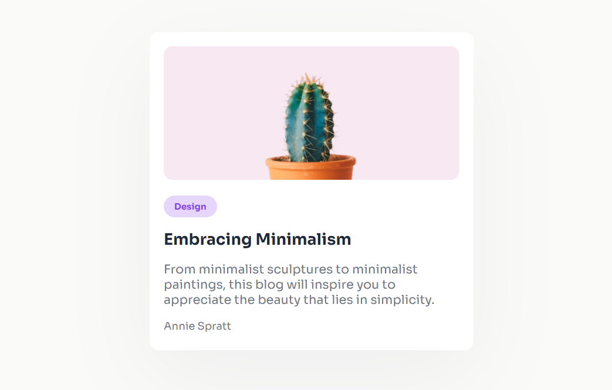

# devChallenges

## Table of Contents

- [About](#about)
- [Minimal Blog Card](#minimal_blog_card)

## About 

devChallenges es una plataforma que te permite practicar realizando diferentes proyectos.

> [!NOTE]  
> Podéis encontrar la página [aquí](https://devchallenges.io/)

# Minimal Blog Card

Minimal Blog Card es un mini ejercicio que consiste en replicar con HTML y CSS una tarjeta con estilo minimalista.

Es un ejercico introductorio para poder continuar con el resto de la plataforma.
